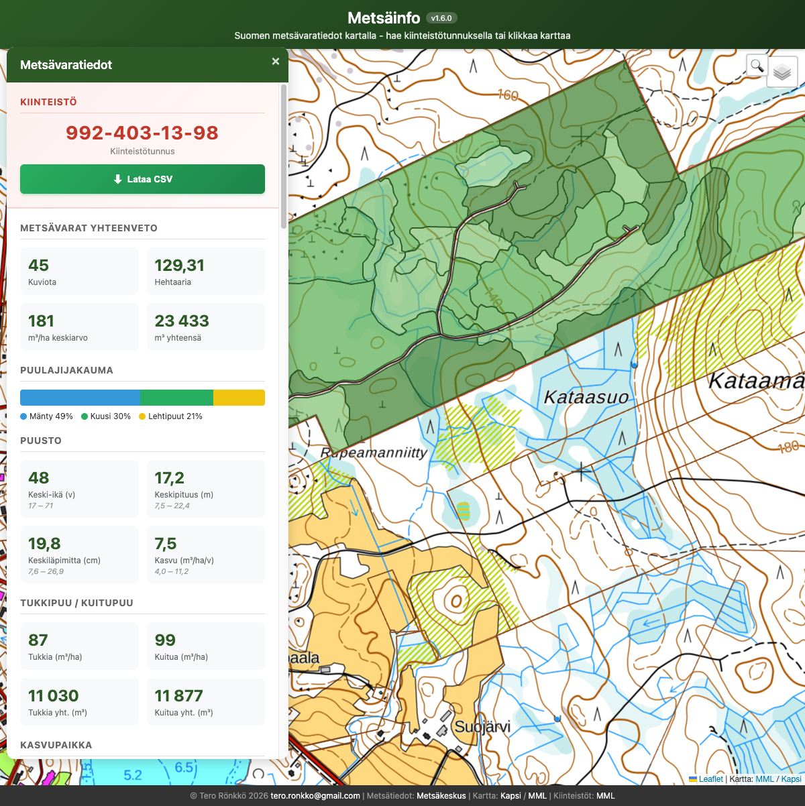

# Metsäinfo

Interaktiivinen karttasovellus Suomen metsävaratietojen tarkasteluun. Hae kiinteistötunnuksella tai klikkaa karttaa ja saat yhteenvedon alueen metsäkuvioista.

**[Kokeile sovellusta](https://trotor.github.io/metsainfo/)**



## Ominaisuudet

- **Kiinteistöhaku** - Hae kiinteistötunnuksella (esim. 592-404-1-32)
- **Kiinteistörajat** - MML:n kiinteistörajat näkyvät kartalla zoomattaessa
- **Metsävaratiedot** - Kuviokohtaiset tiedot Metsäkeskuksen avoimesta datasta
- **Yhteenveto** sisältäen:
  - Kuvioiden lukumäärä ja pinta-ala
  - Puuston tilavuus (m³/ha ja yhteensä)
  - Puulajijakauma (mänty, kuusi, lehtipuut)
  - Puuston keski-ikä, -pituus, -läpimitta ja kasvu
  - Tukkipuu/kuitupuu -jako (keskiarvo ja kokonaismäärä)
  - Kasvupaikkatyypit ja kehitysluokat
  - Hakkuu- ja metsänhoitoehdotukset vuosineen
- **Kuviokohtaiset tiedot** - Laajennettava lista kaikista kuvioista yksityiskohtineen
- **Karttakorostukset** - Klikkaa kuviota tai ehdotusta korostaaksesi sen kartalla

## Käyttö

1. Avaa sovellus selaimessa
2. **Hae kiinteistötunnuksella** oikeasta yläkulmasta (esim. 592-404-1-32)
3. Tai zoomaa haluamallesi alueelle ja **klikkaa kiinteistöä** kartalla
4. Tarkastele metsätietoja infoikkunassa
5. Klikkaa kuviota listassa nähdäksesi yksityiskohdat ja korostaaksesi kartalla

Kiinteistörajat ja -tunnukset näkyvät zoomattaessa lähemmäs (noin 1:50000 mittakaavasta alkaen).

## Tekniikka

Sovellus toimii kokonaan selaimessa ilman backendiä.

- **Leaflet.js** - Karttakirjasto
- **Proj4js** - Koordinaatistomuunnokset (EPSG:3067 ↔ WGS84)
- **OpenStreetMap** - Taustakartta

## Datalähteet

| Data | Lähde | Rajapinta |
|------|-------|-----------|
| Metsävaratiedot | [Metsäkeskus](https://www.metsakeskus.fi/fi/avoin-metsa-ja-luontotieto) | WFS |
| Kiinteistörajat | [MML INSPIRE](https://www.maanmittauslaitos.fi/) | WFS |
| Taustakartta | [OpenStreetMap](https://www.openstreetmap.org/) | TMS |

## Kehitys

Kloonaa repositorio ja käynnistä paikallinen palvelin:

```bash
git clone git@github.com:trotor/metsainfo.git
cd metsainfo
python3 -m http.server 8080
```

Avaa selaimessa: http://localhost:8080

## Versiohistoria

- **v1.1.0** (2026-01-20) - Kiinteistöhaku, kuviokohtaiset tiedot, karttakorostukset
- **v1.0.0** (2026-01-19) - Ensimmäinen julkaisu

## Lisenssi

MIT

## Tekijä

**Tero Rönkkö**

Tehty [Claude Code](https://claude.ai/code) -työkalun avustuksella.
