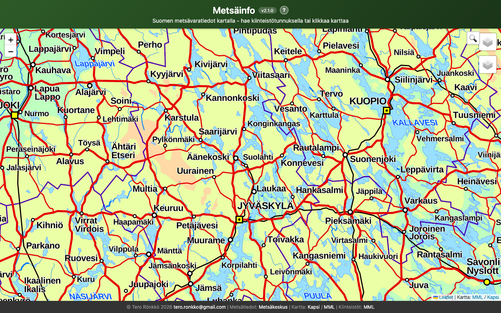

# Metsäinfo

[](https://modelcontextprotocol.io/)
[](https://claude.ai/code)
[](LICENSE)
[](https://trotor.github.io/metsainfo/)

Interaktiivinen karttasovellus Suomen metsävaratietojen tarkasteluun. Hae kiinteistötunnuksella tai klikkaa karttaa ja saat yhteenvedon alueen metsäkuvioista. Sisältää MCP-palvelimen metsätietojen hakuun tekoälytyökaluissa.

**[Kokeile sovellusta](https://trotor.github.io/metsainfo/)**



## Ominaisuudet

### Karttasovellus

- **Kiinteistöhaku** - Hae kiinteistötunnuksella (esim. 592-404-1-32)
- **Kiinteistörajat** - MML:n kiinteistörajat näkyvät kartalla zoomattaessa
- **Metsävaratiedot** - Kuviokohtaiset tiedot Metsäkeskuksen avoimesta datasta
- **Yhteenveto** sisältäen:
  - Kuvioiden lukumäärä ja pinta-ala
  - Puuston tilavuus (m³/ha ja yhteensä)
  - Puulajijakauma (mänty, kuusi, lehtipuut)
  - Puuston keski-ikä, -pituus, -läpimitta ja kasvu
  - Tukkipuu/kuitupuu -jako (keskiarvo ja kokonaismäärä)
  - Kasvupaikkatyypit ja kehitysluokat
  - Hakkuu- ja metsänhoitoehdotukset vuosineen
- **Kuviokohtaiset tiedot** - Laajennettava lista kaikista kuvioista yksityiskohtineen
- **Karttakorostukset** - Klikkaa kuviota tai ehdotusta korostaaksesi sen kartalla
- **Väritysvaihtoehdot** - Kuvioiden väritys tilavuuden, iän, puulajin tai kehitysluokan mukaan
- **Luontotietokerros** - Metsälain erityisen tärkeät elinympäristöt (METE-kohteet)
- **Metsänkäyttöilmoitukset** - Ilmoitetut hakkuualueet kartalla, väritys vuoden tai hakkuutarkoituksen mukaan
- **Sanasto-tooltipit** - (i)-kuvake selittää metsäalan termit selkokielellä
- **URL-jako** - Kopioi suora linkki kiinteistöön jaettavaksi
- **Mittausvuosi-indikaattori** - Näyttää aineiston mittausvuoden ja varoittaa vanhasta datasta
- **CSV-lataus** - Lataa kuviotiedot taulukkolaskentaohjelmaan
- **Tulostus** - Tulosta yhteenveto paperille
- **Käyttöohje** - Otsikkorivin ?-napista aukeava ohjeikkuna

### MCP-palvelin (AI-integraatio)

- **Metsävarahaku tekoälyllä** - Hae kiinteistön metsätiedot suoraan AI-keskustelussa
- **Claude Code & Claude Desktop** - Valmis MCP-konfiguraatio
- **Kattava yhteenveto** - Puusto, puulajit, kehitysluokat, hakkuu- ja hoitoehdotukset

## Käyttö

1. Avaa sovellus selaimessa
2. **Hae kiinteistötunnuksella** oikeasta yläkulmasta (esim. 592-404-1-32)
3. Tai zoomaa haluamallesi alueelle ja **klikkaa kiinteistöä** kartalla
4. Tarkastele metsätietoja infoikkunassa
5. Klikkaa kuviota listassa nähdäksesi yksityiskohdat ja korostaaksesi kartalla

Kiinteistörajat ja -tunnukset näkyvät zoomattaessa lähemmäs (noin 1:50000 mittakaavasta alkaen).

Lisätietoja löytyy sovelluksen otsikkorivin **?**-napista.

## MCP-palvelin (tekoälyintegraatio)

Metsäinfon metsävaratiedot ovat käytettävissä myös tekoälytyökaluissa [MCP-palvelimen](https://modelcontextprotocol.io/) kautta. MCP (Model Context Protocol) mahdollistaa metsätietojen hakemisen suoraan tekoälykeskustelussa.

### Esimerkki

Kysy tekoälyltä esimerkiksi:
- *"Hae metsävaratiedot kiinteistölle 592-404-1-32"*
- *"Paljonko tukkipuuta on kiinteistöllä 592-404-1-32?"*

### Asennus Claude Codeen

MCP-palvelin on valmiiksi konfiguroitu `.mcp.json`-tiedostossa. Kun avaat projektin [Claude Codessa](https://claude.ai/code), palvelin käynnistyy automaattisesti.

### Asennus Claude Desktopiin

Lisää `claude_desktop_config.json`-tiedostoon:

```json
{
  "mcpServers": {
    "metsainfo": {
      "command": "uv",
      "args": ["run", "--with", "fastmcp", "--with", "certifi", "fastmcp", "run", "/polku/metsainfo/mcp-server/server.py"]
    }
  }
}
```

Korvaa `/polku/metsainfo/` projektin todellisella polulla. Vaatii [uv](https://docs.astral.sh/uv/):n asennuksen.

### Työkalut

| Työkalu | Kuvaus |
|---------|--------|
| `hae_metsavaratieto(kiinteistotunnus)` | Ihmisluettava yhteenveto: pinta-ala, tilavuus, puulajit, hakkuuehdotukset |
| `hae_raakadata(kiinteistotunnus)` | JSON-raakadata: kuviokohtaiset mittaustiedot tekoälymallin analysoitavaksi |

Kiinteistötunnus voi olla muodossa `592-404-1-32` tai `05924040000132`.

**hae_raakadata** palauttaa JSON-muotoisen vastauksen, joka sisältää `statistics`-yhteenvedon ja `features`-taulukon kuviokohtaisine mittaustietoineen (ilman geometriaa). Sopii laskelmien, vertailujen ja räätälöityjen suositusten tuottamiseen.

## Tekniikka

Sovellus toimii kokonaan selaimessa ilman backendiä. Koodi on jaettu ES6-moduuleihin.

- **Leaflet.js** - Karttakirjasto
- **Proj4js** - Koordinaatistomuunnokset (EPSG:3067 ↔ WGS84)
- **Proj4Leaflet** - EPSG:3067 natiivituki Leafletille
- **Kapsi/MML** - Suomalaiset taustakartat (peruskartta, taustakartta, ortokuva)

### Tiedostorakenne

```
├── index.html          # HTML-runko, CDN-importit
├── js/
│   ├── app.js          # Päämoduuli: alustus, tapahtumat
│   ├── config.js       # Asetukset, koodistot, värimoodit
│   ├── state.js        # Sovelluksen tila
│   ├── utils.js        # Koordinaatit, geometria, muotoilu
│   ├── styles.js       # Karttatasojen tyylit
│   ├── data.js         # WFS-haut ja suodatus
│   ├── statistics.js   # Tilastolaskenta
│   └── ui.js           # Käyttöliittymän renderöinti
├── style.css           # Tyylit
├── version.js          # Versiotiedot
└── mcp-server/
    ├── server.py       # MCP-palvelin (FastMCP)
    ├── pipeline.py     # WFS-haut ja tilastolaskenta
    └── codes.py        # Koodistomääritykset
```

## Datalähteet

| Data | Lähde | Rajapinta |
|------|-------|-----------|
| Metsävaratiedot | [Metsäkeskus](https://www.metsakeskus.fi/fi/avoin-metsa-ja-luontotieto) | WFS |
| Luontokohteet | [Metsäkeskus](https://www.metsakeskus.fi/fi/avoin-metsa-ja-luontotieto) | WFS |
| Metsänkäyttöilmoitukset | [Metsäkeskus](https://www.metsakeskus.fi/fi/avoin-metsa-ja-luontotieto) | WFS |
| Kiinteistörajat | [MML INSPIRE](https://www.maanmittauslaitos.fi/) | WFS |
| Taustakartat | [Kapsi](https://kartat.kapsi.fi/) / [MML](https://www.maanmittauslaitos.fi/) | TMS (EPSG:3067) |

## Kehitys

Kloonaa repositorio ja käynnistä paikallinen palvelin:

```bash
git clone git@github.com:trotor/metsainfo.git
cd metsainfo
python3 -m http.server 8080
```

Avaa selaimessa: http://localhost:8080

Ei build-vaihetta, ei riippuvuuksia asennettavaksi.

### Tekoälyavusteinen kehitys

Tämä sovellus on kehitetty kokonaan [Claude Code](https://claude.ai/code) -työkalulla. Claude Code on Anthropicin CLI-työkalu tekoälyavusteiseen ohjelmistokehitykseen.

Katso [CLAUDE-HOWTO.md](CLAUDE-HOWTO.md) jossa on:
- Kuvaus kehitysprosessista
- Esimerkkiprompteja sovelluksen jatkokehittämiseen
- Ideoita tekoälyominaisuuksien lisäämiseen sovellukseen
- Ohjeet Claude API:n integrointiin

## Versiohistoria

- **v3.0.0** (2026-03-05) - Metsänkäyttöilmoitukset karttataso
- **v2.3.0** (2026-02-21) - MCP-palvelimen dokumentaatio
- **v2.1.0** (2026-02-19) - Käyttöohjeet ja versiohistoria sovelluksessa
- **v2.0.0** (2026-02-19) - Koodin modularisointi ES6-moduuleiksi
- **v1.9.0** (2026-02-19) - Luontotietokerros, sanasto-tooltipit, väritysvaihtoehdot, tulostustuki
- **v1.8.0** (2026-02-19) - URL-jako ja mittausvuosi-indikaattori
- **v1.6.0** (2026-01-22) - EPSG:3067 projektio, Kapsi/MML taustakartat, karttatasojen valitsin
- **v1.5.0** (2026-01-22) - Koodistojen korjaus Metsäkeskuksen virallisen määrityksen mukaiseksi
- **v1.4.0** (2026-01-22) - CSV-lataus metsäkuviotiedoille
- **v1.3.0** (2026-01-21) - Moniosaisten kiinteistöjen tuki, min/max-tilastot
- **v1.1.0** (2026-01-20) - Kiinteistöhaku, kuviokohtaiset tiedot, karttakorostukset
- **v1.0.0** (2026-01-19) - Ensimmäinen julkaisu

## Lisenssi

MIT

## Tekijä

**Tero Rönkkö**

Tehty [Claude Code](https://claude.ai/code) -työkalun avustuksella.
